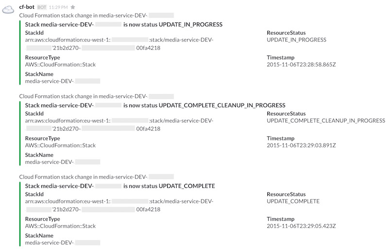

# CF Notify

## What?
An AWS Lambda function that will post Cloud Formation status updates to a Slack channel via a Slack Web Hook.


## Why?
To give visibility of Cloud Formation changes to the whole team in a quick and simple manner. For example:




## How?
CF Notify has a stack of AWS resources consisting of:
 - An SNS Topic
 - A Lambda function, which uses the SNS Topic as an event source
 - An IAM Role to execute the Lambda function

We add the SNS Topic of CF Notify to the notification ARNs of the Stack we want to monitor.
Search for `NotificationARNs.member.N` [here](http://docs.aws.amazon.com/AWSCloudFormation/latest/APIReference/API_UpdateStack.html)
for more information on notification ARNs.


## Setup

To setup CF Notify, we need to do the following.

### Prerequisites
#### Slack incoming webhook
You can create an incoming webhook [here](https://my.slack.com/services/new/incoming-webhook/).


### Deploy Lambda

This is done using the script [deploy.sh](./deploy.sh).

```sh
./deploy.sh $CHANNEL $WEBHOOK
```

Where:
 - CHANNEL is the Slack channel or user to send messages to. It will be used in the naming of the Lambda artifact file stored in S3.
 - WEBHOOK is the Web Hook URL of an Incoming Web Hook (see https://api.slack.com/incoming-webhooks).

`deploy.sh` will create a zip file and upload it to S3 and also create a cloud formation stack using the [template](./cf-notify.json).

## Usage

Once setup is complete, all you need to do now is set the notification ARN when you update any Cloud Formation stack:

```sh
SNS_ARN=`aws cloudformation describe-stacks --stack-name cf-notify-$CHANNEL | jq ".Stacks[].Outputs[].OutputValue"  | tr -d '"'`

aws cloudformation [create-stack|update-stack|delete-stack] --notification-arns $SNS_ARN
```

You should now see messages in Slack!
